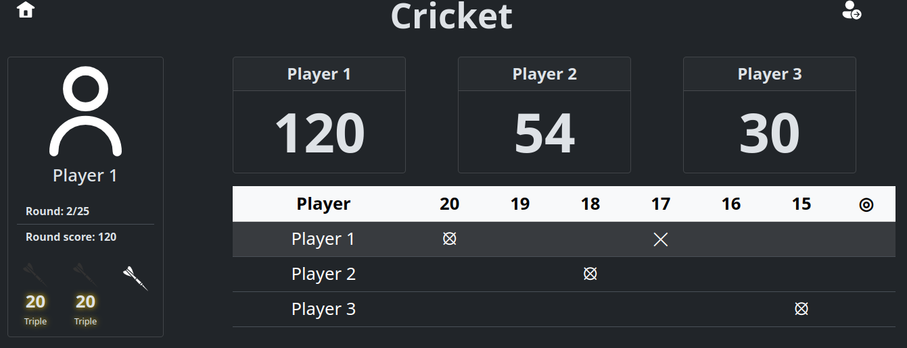

# The Dartsout! game

A simple darts game.



## Dartboard Hardware and Firmware

[Dartsout! Hardware](https://github.com/GuilleGonzzalez/hw-dartsout)

[Dartsout! Firmware](https://github.com/GuilleGonzzalez/fw-dartsout)

## Installation

- Clone repository ```git clone https://github.com/GuilleGonzzalez/dartsout```
- Go to directory ```cd dartsout```
- Install dependencies ```mongoose``` and ```cjson```. In arch:
  - ```sudo pikaur -S mongoose```
  - ```sudo pacman -S cjson```
- Compile ```make```
- Execute program ```./dartsout```
- ```localhost:8000``` in explorer

## Games

### Cricket

- Cricket normal
- Cricket no score (TODO)
- Cricket cut throat (TODO)
- Cricket wild (TODO)
- Cricket crazy (TODO)
- Cricket wild and crazy (TODO)

### X01

- 301
- 501
- 701
- 901
- 1001

#### Options

- Double in
- Double out

## TODOs rapidos

llamar a game_manager_finish


### Múltiples juegos 1

Implementando la funcionalidad de poder tener varias instancias de juegos, de forma que puedan existir varias partidas a la vez.
La idea es que cada partida (cada game), tenga un ID distinto. Un jugador podrá unirse a una partida ya iniciada (ya se ha pulsado en Play Cricket / Play xxxx) introduciendo su ID, que el creador de la partida podrá facilitar por otra vía.
El problema es que el ID del juego se genera en new_game (al pulsar en Play xxxx), pero al añadir jugadores ya es necesario este gameID.
Soluciones:

- El gameId se crea al pulsar sobre Play XXX, y sale otro menú para añadir jugadores
  - PROS: soluciona el problema
  - CONS: nuevo menú, menos inteligente
- El gameId se crea al añadir el primer jugador
  - PROS: soluciona el problema
  - CONS: no me parece que sea una solución limpia
- New player no necesita gameId <--- ESTA es la buena
  - PROS: soluciona el problema, misma interfaz
  - CONS: se puede? ---> SI

Implementación de la solución seleccionada:

- El servidor no es el que lleva la cuenta de los jugadores, es el cliente el que crea una lista que al pulsar 'Play', se la pasará de una vez, quizá en el mensaje de new_game (cambiar a ws)
- new player no genera un evento, solo responde con datos de interés (ahora nada, en el futuro será, username, name, mpr, clasificación, etc).

### Múltiples juegos 2

1. El usuario genera una lista de los nombres de los jugadores.
2. El usuario decide el juego al que jugar.
3. El pulsar 'Play Cricket', con sus opciones, el cliente debe enviar un mensaje de 'new_game' y recibir un identificador de juego.
4. Cuando se recibe el identificador, el cliente redirige a '/game.html?id=XX'.
5. Al cargarse '/game.html?id=XX' lo único que debe hacer es pedir el estado de la partida con ese ID.

### Múltiples dianas

Problema:

Cómo asociar una diana a un juego. La diana debería saber el game_id para hacer el POST del nuevo dardo a 'new_dart?id=XX'. Además, puede haber varias dianas en un juego, cada una asociada a uno o más jugadores. La diana debería tener un board_id y al objeto player, al principio de la partida, se le asocia una diana. player->board_id = XX.

Posibles soluciones:

- Se introduce el game_id en la diana con los sectores 1-9 (el game_id no tendría 0s y tendría que modificarse para tener unos 5.10 números). Como feedback al usuario, se enciende un led / suena un buzzer cada vez que se marca un número.
  - CONS: tedioso
- La diana tiene una web de configuración. En el mismo sitio en el que se configura el wifi y server, se configura el game_id.
  - CONS: tedioso
- Un usuario tiene asociada una diana: se guarda en la base de datos el usuario con su diana (por ejemplo, la mac del esp) y siempre juega con la misma. Se puede cambiar en ajustes de usuario.
  - CONS: no se puede jugar sin usuario
- Se modifica la diana para tener una cruzeta y una pantalla para escribir (como flipper) o un teclado y un buzzer.
- La diana tiene un número de serie y el usuario lo introduce al jugar en la plataforma <---- ESTA va a ser la buena.
  - Este número de serie sería la MAC del ESP (o sus últimos 6 dígitos) y se mandaría en el POST de 'new-dart', habría una pegatina en la diana con este número. Ej: 'SN:4B91CDD651AF'.
  - En 'new-game' en vez de enviar ['name1', 'name2', etc.], se enviaría [{'name': 'name1', 'board_id': 'D651AF'}, {'name': 'name2', 'board_id': 'D651AF'}].
  - PROS: se soluciona tanto lo de que la diana sepa el game_id como lo de que cada jugarod pueda tener una diana diferente.

## Messages

### 1. Status (msg_id=0)

```json
{
  "msg_id": 0,
  "running": false,
  "game_id": 0,
  "options": 0,
  "n_players": 1,
  "players": [
    {
      "user_id": "user1",
      "name": "name1",
    },
    {
      "user_id": "user2",
      "name": "name2",
    }
  ]
}
```

### 2. Cricket (msg_id=1)

```json
{
  "msg_id": 1,
  "n_players": 1,
  "round": 0,
  "max_rounds": 0,
  "max_score": 0,
  "current_player": 0,
  "darts": 0,
  "dart_scores": [
    {
      "num": 0,
      "zone": 0,
    },
    {
      "num": 0,
      "zone": 0,
    },
    {
      "num": 0,
      "zone": 0,
    },
  ],
  "enabled": [16, 17, 18],
  "players": [
    {
      "name": "name1",
      "game_score": 0,
      "round_score": 0,
      "mpr": 1,
      "img_path": "res/user.svg",
      "shots": [0, 0, 0, 0, 0, 0, 0]
    }
  ]
}
```

### 3. X01 (msg_id=2)

```json
{
  "msg_id": 2,
  "score": 301,
  "n_players": 1,
  "round": 0,
  "max_rounds": 0,
  "current_player": 0,
  "darts": 0,
  "dart_scores": [
    {
      "num": 0,
      "zone": 0,
    },
    {
      "num": 0,
      "zone": 0,
    },
    {
      "num": 0,
      "zone": 0,
    },
  ],
  "players": [
    {
      "name": "name1",
      "game_score": 0,
      "round_score": 0,
    }
  ],
}
```

### 4. Last dart (msg_id=3)

```json
{
  "msg_id": 3,
  "valid": true,
  "num": 0,
  "zone": 0,
}
```

### 5a. Winner (msg_id=4)

```json
{
  "msg_id": 4,
  "name": "name1",
}
```

### 5b. Cricket winner (msg_id=4)

```json
{
  "msg_id": 4,
  "game_id": 0,
  "name": "name1",
  "players": [
    {
      "name": "name1",
      "game_score": 0,
      "mpr": 1,
    }
    {
      "name": "name2",
      "game_score": 0,
      "mpr": 1,
    }
  ],
}
```

### 6. Game ID (msg_id=5)

```json
{
  "msg_id": 5,
  "game_id": 0,
}
```


### Easy and prior fixes

- Cricket game modes implementation
- Bootstrap alerts instead alert()
- New sounds (po po po)
- When new connection, a new canvas is created below the original
- When there is a game running if someone enters in dartsout server, msg to go there o directly redirect
- Add player button
- Si estoy en /game y no hay juego, redirigir a /; si estoy en / y hay juego, redirigir a /game
- Arreglar status / new_player
- Add logger [example](https://github.com/yksz/c-logger/tree/master)

### Mid-term issues

- fw-dartsout IP and WiFi config
- Back button
- New games
- Multiple dartboards (board_id)

### Future features

- DB integration
- Stats button
- Configurable IP/port
