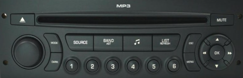

# Dartsout!

A simple darts game.



## Hardware

[Dartsout Hardware](https://github.com/GuilleGonzzalez/hw-dartsout)
[Dartsout Firmware](https://github.com/GuilleGonzzalez/fw-dartsout)

## Installation

- Clone repository ```git clone https://github.com/GuilleGonzzalez/dartsout ```
- Compile ```make```
- Go to directory ```cd dartsout```
- Execute program ```./dartsout```
- ```localhost:8000``` in explorer

## TODO list

### Easy and prior fixes
- Fix winner player (if points == 0 not working right)
- Fix circket score cards (too large)
- Cricket game modes implementation
- Remove home and next player button in home header

### Requested features
- MPR, MPD
- New games
- Multiple dartboards (board_id)
- External access (server with nginx)

### Future features
- DB integration
- Stats button
- Configurable IP/port